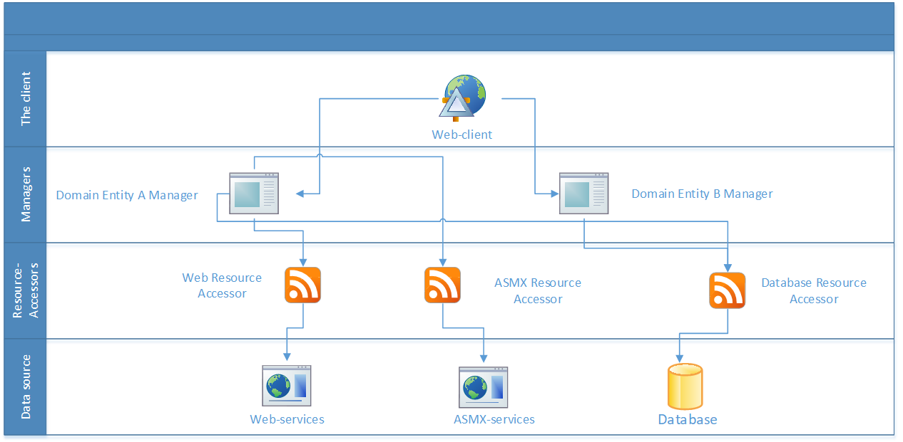
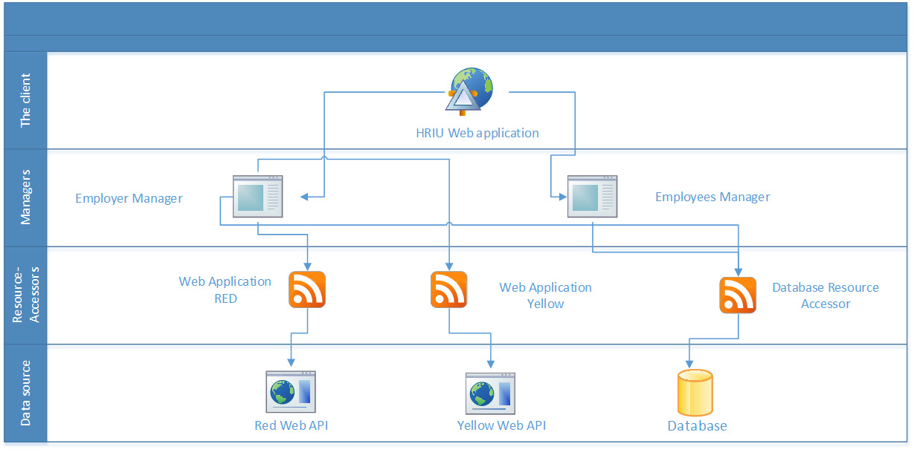

# Architecture

## Design principles

The architecture behind the Booking Platform is based on the [IDesign Method](https://www.idesign.net/Download/IDesign-Method-Management-Overview.pdf).

Following the Method's guidelines, the system is decomposed into several services, each addressing a volatility of the system itself. Moreover, the services are spread across different layers, each layer having a specific role in the overall architecture.

## Architecture layers

The services composing this system are spread across different layers. Services within each layer can only consume services in layers below their own.

The layers are:

- **Managers**: the services in this layer are responsible for encapsulating the core use cases that the system will have to handle.
- **Engines**: optional, doesn't cover here. the services in this layer are responsible for encapsulating complex workflows that include multiple resources and can be used by multiple managers.
- **Resource access**: the services in this layer are responsible for encapsulating the access to external resources, be it databases or external services.
- **Resources**: in this layer are placed all the external resources access by the services from the *Resource Access* layer.

Due to the nature of this project, multiple services are packaged into deployable units. These units are referred as **Apps**.

## Services

The services that compose this system are split between class libraries meant to be referenced by the deployable applications.

Each class library contains a service that performs the role of the library in the system and migth contain one or more internal services used to spread the complexity of the service.

Here is an overview of the architecture that shows the different services in the layer they belong to.

### Managers

Services in this layer are responsible for performing the core use cases of the system by coordinating underlying services.

### Resource Access

Services in this layer are responsible for encapsulating the access to external resources.

## Applications

The platform is composed mainly by 3 applications. The applications have the responsibility to host the various services and use them to perform the different use cases handled by this system.

### API

This application is the entrypoint of the system and it exposes all the functionalities needed to interact with the system via a set of HTTP endpoints.

Here is a graphical representation of the services and resources it uses to perform its role in the system.

- Red Web API. An external for us application
- Yellow Web API. And external for us application
